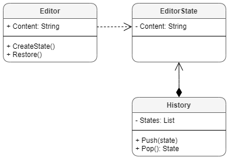

# CSharp-DesignPatterns

* Patterns
  * [Memento](#Memento) 

## Memento



C# Code

```c#

public class EditorState
{
    private readonly string _content;
    public string Content => _content;

    public EditorState(string content)
    {
        _content = content;
    }
}

public class History
{
    private readonly List<EditorState> _states = new();

    public void Push(EditorState state)
    {
        _states.Add(state);
    }

    public EditorState Pop()
    {
        int index = _states.Count - 1;

        EditorState state = _states[index];
        _states.RemoveAt(index);

        return state;
    }
}
    
public class Editor
{
    private string _content;
    public string Content
    {
        get => _content;
        set => _content = value;
    }

    public EditorState CreateState()
    {
        return new EditorState(_content);
    }

    public void Restore(EditorState state)
    {
        _content = state.Content;
    }
}


class Program
{
    static void Main(string[] args)
    {
        Editor editor = new Editor();
        History history = new History();

        editor.Content = "Content-1";
        history.Push(editor.CreateState());
        Console.WriteLine("Current: " + editor.Content);

        editor.Content = "Content-2";
        history.Push(editor.CreateState());
        Console.WriteLine("Current: " + editor.Content);

        Console.WriteLine("------------------");

        editor.Content = "Content-3";
        editor.Restore(history.Pop());
        editor.Restore(history.Pop());
        Console.WriteLine("Current: " + editor.Content);
    }
}
```

Console Output

```console
Current: Content-1
Current: Content-2
------------------
Current: Content-1
```
