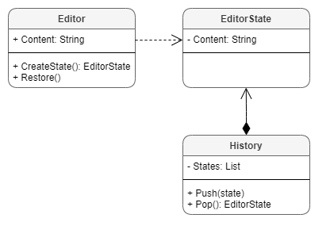
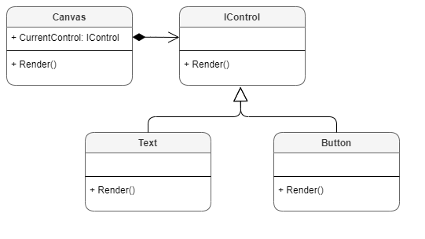
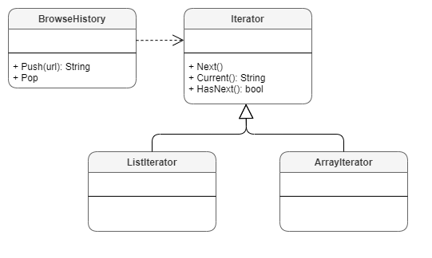
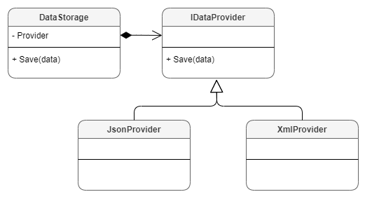
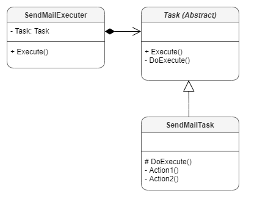

# CSharp-DesignPatterns

* Patterns
  * [Memento](#Memento) 
  * [State](#State) 
  * [Iterator](#Iterator) 
  * [Strategy](#Strategy)
  * [TemplateMethod](#TemplateMethod)

## Memento



C# Code

```c#

public class EditorState
{
    private readonly string _content;
    public string Content => _content;

    public EditorState(string content)
    {
        _content = content;
    }
}

public class History
{
    private readonly List<EditorState> _states = new();

    public void Push(EditorState state)
    {
        _states.Add(state);
    }

    public EditorState Pop()
    {
        int index = _states.Count - 1;

        EditorState state = _states[index];
        _states.RemoveAt(index);

        return state;
    }
}
    
public class Editor
{
    private string _content;
    public string Content
    {
        get => _content;
        set => _content = value;
    }

    public EditorState CreateState()
    {
        return new EditorState(_content);
    }

    public void Restore(EditorState state)
    {
        _content = state.Content;
    }
}


class Program
{
    static void Main(string[] args)
    {
        Editor editor = new Editor();
        History history = new History();

        editor.Content = "Content-1";
        history.Push(editor.CreateState());
        Console.WriteLine("Current: " + editor.Content);

        editor.Content = "Content-2";
        history.Push(editor.CreateState());
        Console.WriteLine("Current: " + editor.Content);

        Console.WriteLine("------------------");

        editor.Content = "Content-3";
        editor.Restore(history.Pop());
        editor.Restore(history.Pop());
        Console.WriteLine("Current: " + editor.Content);
    }
}

```

Console Output

```console
Current: Content-1
Current: Content-2
------------------
Current: Content-1
```

***

## State



C# Code

```c#

public interface IControl
{
    void Render();
}
 
public class TextControl : IControl
{
    public void Render()
    {
        Console.WriteLine("Render: Text");
    }
}

public class ButtonControl : IControl
{
    public void Render()
    {
        Console.WriteLine("Render: Button");
    }
}

public class Canvas
{
    private IControl _currentControl;
    public IControl CurrentControl
    {
        get => _currentControl;
        set => _currentControl = value;
    }

    public void Render()
    {
        _currentControl.Render();
    }
}


class Program
{
    static void Main(string[] args)
    {
        Canvas canvas = new Canvas();

        canvas.CurrentControl = new ButtonControl();
        canvas.Render();

        canvas.CurrentControl = new TextControl();
        canvas.Render();
    }
}
```

Console Output

```console
Render: Button
Render: Text
```

***

## Iterator



C# Code

```c#

public interface IIterator
{
    string Current // Can be generic
    {
        get;
    }
    bool HasNext();
    void Next();
}

public class BrowseHistory
{
    private readonly List<string> _urlList = new();

    public void Push(string url)
    {
        _urlList.Add(url);
    }

    public string Pop()
    {
        var index = _urlList.Count - 1;

        var url = _urlList[index];
        _urlList.RemoveAt(index);

        return url;
    }

    public IIterator CreateIterator()
    {
        return new ListIterator(this);
    }

    private class ListIterator : IIterator
    {
        private readonly BrowseHistory _browseHistory;
        private int _index;

        public string Current => _browseHistory._urlList[_index];

        public ListIterator(BrowseHistory browseHistory)
        {
            _browseHistory = browseHistory;
        }

        public bool HasNext()
        {
            return _index < _browseHistory._urlList.Count;
        }

        public void Next()
        {
            _index++;
        }
    }
}


class Program
{
    static void Main(string[] args)
    {
        var browseHistory = new BrowseHistory();
        browseHistory.Push("https://www.google.com");
        browseHistory.Push("https://www.bing.com");
        browseHistory.Push("https://www.yandex.com");

        Console.WriteLine("Browse History");
        IIterator iterator = browseHistory.CreateIterator();
        while (iterator.HasNext())
        {
            var url = iterator.Current;
            Console.WriteLine($"Url: {url}");
            iterator.Next();
        }
    }
}
```

Console Output

```console
Browse History
Url: https://www.google.com
Url: https://www.bing.com
Url: https://www.yandex.com
```

***

## Strategy



C# Code

```c#
public interface IDataProvider
{
    void Save(string data);
}

public class JsonDataProvider : IDataProvider
{
    public void Save(string data)
    {
        Console.WriteLine("SaveData: JSON");
    }
}

public class XmlDataProvider : IDataProvider
{
    public void Save(string data)
    {
        Console.WriteLine("SaveData: XML");
    }
}

public class DataStorage
{
    private IDataProvider _dataProvider;

    public DataStorage(IDataProvider dataProvider)
    {
        _dataProvider = dataProvider;
    }

    public void Save(string data)
    {
        _dataProvider.Save(data);
    }

    public void Save(string data, IDataProvider provider)
    {
        provider.Save(data);
    }
}


class Program
{
    static void Main(string[] args)
    {
        Console.WriteLine("With Constructor Injection");
        DataStorage storage = new DataStorage(new XmlDataProvider());
        storage.Save("data");

        Console.WriteLine("With Method Injection");
        storage.Save("data", new JsonDataProvider());
    }
}
```

Console Output

```console
With Constructor Injection
SaveData: XML
With Method Injection
SaveData: JSON
```

***

## TemplateMethod



C# Code

```c#

public abstract class Task
{
    public void Execute()
    {
        Console.WriteLine("Execute()");
        Console.WriteLine("- Do: Something General");

        Action1();
        Action2();
    }

    protected abstract void Action1();
    protected abstract void Action2();
}

public class SendMailTask : Task
{
    protected override void Action1()
    {
        Console.WriteLine("- Do: Action1");
    }

    protected override void Action2()
    {
        Console.WriteLine("- Do: Action2");
    }
}

public class SendMailExecuter
{
    private Task _task;

    public SendMailExecuter()
    {
        _task = new SendMailTask();
    }

    public void Execute()
    {
        _task.Execute();
    }
}


class Program
{
    static void Main(string[] args)
    {
        var executer = new SendMailExecuter();
        executer.Execute();
    }
}
```

Console Output

```console
Execute()
- Do: Something General
- Do: Action1
- Do: Action2
```
